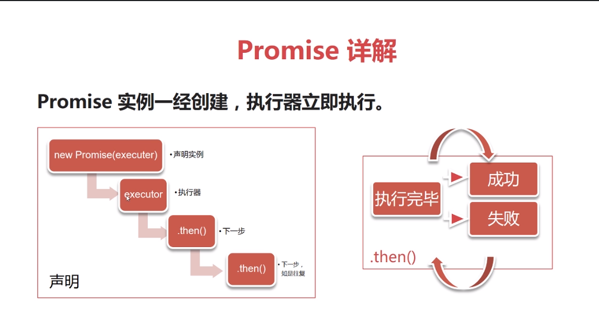

# promise
* Promise对象用于异步计算。
* 将异步操作队列化，按照期望的顺序执行并返回符合预期的结果。
* 可以在对象之间传递和操作Promise
* 处理队列
### 异步操作的常见语法
  jquery ajax
```javascript
  $.ajax('http://baidu.com', {
      success: function(res) {
          console.log(res)
      }
  })
  ```
  或者在页面加载完毕后回调
```javascript
$(function() {
  // 回调函数
})
```
### 异步回调问题
嵌套层次很深，难以维护
无法正常使用return 和throw
无法正常检索堆栈信息
多个回调之间难以建立联系

### promise使用
````javascript
new Promise(
    
    // 以下为执行器 executor
    function(resolve, reject) {
      //一段异步操作
      
      resolve(); // 数据处理完成
      
      reject(); // 数据处理出错 
    }
).then(function A() {
    // 成功的下一步
  }, function B() {
    // 失败的下一步
    })
````
* promise是一个代理对象，他和原先要进行的操作并无关系
* 她通过引入一个回调，避免更多的回调
* promise有三个状态
    > 1.pending状态，初始化时 
    > 2.fulfilled实现状态， 调用resolve时
    > 3.rejected否决状态 操作失败状态，调用rejected时
* promise状态发生改变，就会触发.then()里的响应函数处理后续步骤
* promise状态一旦改变，就不会再变。

### Promise调用图解


#### 简单实例
* 单次执行
````javascript 1.6
// 定时执行
console.log('here we go');
new Promise(reslove => {
    setTimeout(() => {
        resolve('hello')
    }, 2000);
}).then(value => {
    console.log(value + 'world');
});
````
* 多次顺序执行

````javascript 1.6
// 定时执行
console.log('here we go');
new Promise(resolve => {
    setTimeout(() => {
        resolve('hello')
    }, 2000);
}).then(value => { 
    console.log(value);
    return new Promise(resolve => {
        setTimeout(() => {
            resolve('world')
        })
    }).then(value => {
        console.log(value + 'world');
    })
});
````
* 如果promise是一个很明显的先进先出的队列情况，那么在promise完成后可以追加then()的执行器
* 如果then里面不返回新的promise（也就是再次调用一个promise），则会立即执行它所属的下一个.then()执行器或者父级作用域下的下一个操作
````javascript
console.log('here we go');
new Promise(resolve => {
        setTimeout( () => {
            resolve('hello');
        }, 2000);
    }).then( value => {
        console.log(value);
        console.log('everyone');
        (function () {
            return new Promise(resolve => {
                setTimeout(() => {
                    console.log('Mr.Laurence');
                    resolve('Merry Xmas');
                }, 2000);
            });
        }());
    return false;
    }).then( value => {
        console.log(value + ' world');
    });
````

### .then()
* .then()接受两个函数作为参数，分别代表fulfilled和rejected
* .then()返回一个新的Promise实例，所以他可以链式调用
* 当前面的Promise状态改变时，他会根据其最终状态选择特定的状态响应函数执行
    >状态响应函数可以返回新的Promise或者其它值
    如果返回新的Promise，那么下一级的.then()会在新的Promise状态改变之后执行
    如果返回其他任何值，则会立即执行下一个.then()

     


  